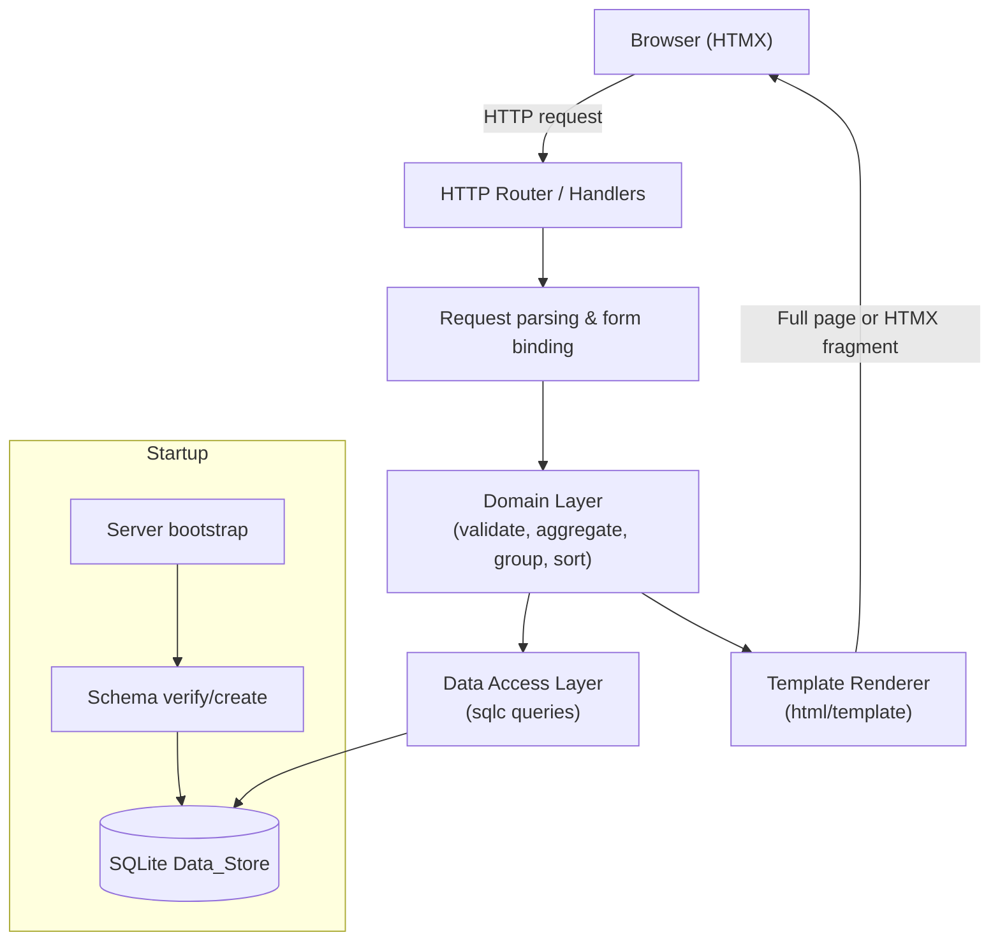

# Design Document

## Overview

The Budget Tracker is a single-user web application for recording and reviewing personal finances. It is built in Go, serves a server-rendered HTML interface enhanced with HTMX for partial page updates, and persists data in a SQLite database accessed through sqlc-generated query code.

The system is organized into four layers:

1. **HTTP layer** – routing, request parsing, and HTMX-aware response rendering.
2. **Domain/service layer** – pure business logic for validation, aggregation (totals, net balance, category breakdown), time-period grouping, and sorting. This layer contains the bulk of the testable correctness logic and has no direct dependency on HTTP or SQL.
3. **Data access layer** – sqlc-generated Go functions wrapping parameterized SQL statements against SQLite, plus schema bootstrap.
4. **Presentation layer** – Go `html/template` templates rendering full pages and HTMX fragments.

### Key Design Decisions

- **Money is stored and computed as integer cents.** Amounts are persisted as a signed 64-bit integer count of cents (`amount_cents`) rather than a floating-point value. This avoids floating-point rounding errors in totals and net-balance computations, and formatting to exactly two decimal places becomes a deterministic integer-to-string operation. Validation enforces the range 0.01–999,999,999.99 (i.e., 1 to 99,999,999,999 cents) with at most two decimal places at the boundary where user text is parsed.
  - *Rationale:* Requirements 1, 2, 5, and 6 require exact two-decimal formatting and correct arithmetic across many transactions; integer cents is the standard technique for correct money handling.
- **The domain layer is pure and framework-agnostic.** Validation, aggregation, grouping, and sorting operate on plain Go structs and slices, independent of HTTP requests and database rows. This makes the core logic unit- and property-testable without a running server or database.
- **HTMX drives partial updates.** Mutating actions (create, edit, delete) return HTML fragments re-rendering only the Transaction Log and Dashboard summary; the root path returns a full page (Requirement 10.1, 10.2).
- **A single request-time SQLite transaction wraps each mutation.** Create/edit/delete commit durably before returning success, and roll back on failure so no partial write persists (Requirements 9.1, 9.5).

## Architecture



### Request Flow

- **Full page load (`GET /`)**: handler loads transactions and computes dashboard summary for the default Time_Period (month), then renders the complete HTML page containing both Dashboard and Transaction Log (Requirement 10.1).
- **Mutations (`POST /transactions`, `PUT/POST /transactions/{id}`, `DELETE /transactions/{id}`)**: handler parses and validates input, performs the persistence operation inside a SQLite transaction, then re-renders and returns only the affected Transaction Log and Dashboard summary fragments (Requirements 1.6, 2.6, 3.5, 4.3, 10.2).
- **View queries (`GET /transactions`, `GET /dashboard`)**: handler reads query parameters (`period`, `type`, `sort`, `dir`), loads transactions, applies grouping/filtering/sorting in the domain layer, and returns the appropriate fragment.

### Startup Sequence

On startup the application opens the SQLite database and runs an idempotent schema bootstrap. If the schema is absent or incomplete it is created before any request is served. If schema creation fails, the server enters a degraded state that rejects all transaction requests with a Data_Store-unavailable error (Requirements 9.2, 9.3, 9.4).

## Components and Interfaces

### HTTP Handlers (`internal/http`)

Responsible for routing, parsing form/query input into domain input structs, invoking domain and repository operations, selecting HTTP status codes, and choosing between full-page and fragment rendering. It inspects the `HX-Request` header to distinguish HTMX partial requests from full navigations where needed.

Routes:

| Method | Path | Purpose | Response |
| --- | --- | --- | --- |
| GET | `/` | Root page | Full HTML page (Dashboard + Log) |
| GET | `/transactions` | Filtered/sorted/grouped log | Log fragment |
| POST | `/transactions` | Create expense or income | Log + Dashboard fragment |
| POST | `/transactions/{id}` | Edit transaction | Log + Dashboard fragment |
| DELETE | `/transactions/{id}` | Delete transaction | Log + Dashboard fragment |
| GET | `/dashboard` | Dashboard summary | Dashboard fragment |

Unknown routes return HTTP 404 with an error page (Requirement 10.3).

### Domain Layer (`internal/budget`)

Pure functions and types with no I/O dependencies.

- `Validate(input TransactionInput) (Transaction, []FieldError)` – validates amount, date, and category; returns a normalized `Transaction` or a list of per-field errors (Requirements 1.2–1.5, 2.2–2.5, 3.3, 3.4).
- `ParseAmount(text string) (cents int64, err error)` – parses a decimal string to integer cents, rejecting non-numeric input, more than two decimal places, values ≤ 0, and values above the maximum.
- `FormatAmount(cents int64) string` – formats integer cents to a fixed two-decimal string.
- `Summary(txns []Transaction) DashboardSummary` – computes total income, total expense, net balance, and per-category expense breakdown (Requirements 5.1–5.4).
- `Group(txns []Transaction, period TimePeriod) []Group` – buckets transactions into day/week(Monday)/month groups ordered most-recent-first, each carrying its own totals and net balance (Requirements 7.1–7.4).
- `Sort(txns []Transaction, field SortField, dir SortDir) []Transaction` – returns a sorted copy, breaking ties by ascending transaction id (Requirements 8.1–8.6).
- `Filter(txns []Transaction, typeFilter TypeFilter) []Transaction` – filters by transaction type or returns all (Requirements 6.5, 6.6).
- `ParsePeriod`, `ParseSort` – parse query parameters, defaulting invalid/absent values (period → month, sort → date descending) per Requirements 7.7, 7.8, 8.7.

### Data Access Layer (`internal/store`)

sqlc-generated code plus a thin repository wrapper exposing:

- `CreateTransaction(ctx, params) (Transaction, error)`
- `GetTransaction(ctx, id) (Transaction, error)` – returns a not-found sentinel when absent (Requirements 3.2, 4.2).
- `UpdateTransaction(ctx, params) (Transaction, error)`
- `DeleteTransaction(ctx, id) error`
- `ListTransactions(ctx) ([]Transaction, error)`
- `EnsureSchema(ctx) error` – idempotent schema creation invoked at startup.

All queries are parameterized via sqlc; mutations run within a transaction that commits on success and rolls back on error so no partial write persists (Requirements 9.1, 9.5).

### Presentation Layer (`internal/web/templates`)

`html/template` templates:

- `page.html` – full page shell embedding dashboard and log partials.
- `dashboard.html` – totals, net balance, and per-category expense breakdown.
- `log.html` – transaction rows, grouped by Time_Period when grouping is active, with an empty-state message.
- `error.html` / `404.html` – error and not-found pages.

Templates auto-escape all user-supplied values (category, description) to prevent injection.

## Data Models

### Domain Types (Go)

```go
type TxType string // "expense" | "income"

type TimePeriod string // "day" | "week" | "month"

type Transaction struct {
    ID          int64
    Type        TxType
    AmountCents int64     // non-negative magnitude; type distinguishes income/expense
    Date        time.Time // date-only (UTC midnight); rendered as YYYY-MM-DD
    Category    string
    Description string    // may be empty
}

type TransactionInput struct {
    ID          int64  // 0 for create
    Type        TxType
    AmountText  string // raw user input, parsed/validated
    DateText    string // raw ISO 8601 text
    Category    string
    Description string
}

type FieldError struct {
    Field   string // "amount" | "date" | "category"
    Message string
}

type CategoryExpense struct {
    Category    string
    TotalCents  int64
}

type DashboardSummary struct {
    TotalIncomeCents  int64
    TotalExpenseCents int64
    NetBalanceCents   int64 // TotalIncomeCents - TotalExpenseCents; may be negative
    ByCategory        []CategoryExpense
}

type Group struct {
    Key     string // e.g. "2024-05-13", "2024-W20", "2024-05"
    Label   string
    Summary DashboardSummary
    Items   []Transaction
}
```

### Persistence Schema (SQLite)

```sql
CREATE TABLE IF NOT EXISTS transactions (
    id           INTEGER PRIMARY KEY AUTOINCREMENT,
    type         TEXT    NOT NULL CHECK (type IN ('expense', 'income')),
    amount_cents INTEGER NOT NULL CHECK (amount_cents > 0 AND amount_cents <= 99999999999),
    date         TEXT    NOT NULL, -- ISO 8601 YYYY-MM-DD
    category     TEXT    NOT NULL CHECK (length(category) BETWEEN 1 AND 100),
    description  TEXT    NOT NULL DEFAULT ''
);

CREATE INDEX IF NOT EXISTS idx_transactions_date ON transactions (date);
```

- `amount_cents` stores the positive magnitude; the sign of an amount in totals is derived from `type`.
- `date` is stored as an ISO 8601 string, which sorts lexicographically in calendar order.
- Database `CHECK` constraints act as a defense-in-depth backstop behind domain validation.

### Query Parameters

| Param | Values | Default |
| --- | --- | --- |
| `period` | `day`, `week`, `month` | `month` |
| `type` | `expense`, `income`, (absent) | both |
| `sort` | `date`, `amount` | `date` |
| `dir` | `asc`, `desc` | `desc` |

Unrecognized values fall back to defaults (Requirements 7.8, 8.7).

## Correctness Properties

*A property is a characteristic or behavior that should hold true across all valid executions of a system — essentially, a formal statement about what the system should do. Properties serve as the bridge between human-readable specifications and machine-verifiable correctness guarantees.*

These properties target the pure domain layer (validation, aggregation, grouping, sorting, money handling) and the persistence round-trip. UI response shape, routing, empty-state messaging, and injected-failure error handling are validated by example-based and integration tests (see Testing Strategy) rather than property tests.

### Property 1: Create round-trip preserves transaction data

*For any* valid transaction input of either type (expense or income), persisting it and then retrieving it SHALL yield a transaction whose type, amount, date, category, and description equal the normalized input, and the persisted transaction SHALL appear in the transaction listing.

**Validates: Requirements 1.1, 1.6, 2.1, 2.6**

### Property 2: Amount validation rejects all invalid amounts

*For any* amount string that is missing, non-numeric, less than or equal to 0, greater than 999,999,999.99, or has more than two decimal places, validation SHALL reject the entry with an error identifying the Amount field, and the set of stored transactions SHALL remain unchanged. Conversely, *for any* amount string in 0.01–999,999,999.99 with at most two decimal places, validation SHALL accept it.

**Validates: Requirements 1.2, 2.2, 3.3**

### Property 3: Date validation accepts only valid ISO 8601 calendar dates

*For any* Transaction_Date string, validation SHALL accept it if and only if it is a valid calendar date in ISO 8601 `YYYY-MM-DD` format; otherwise it SHALL reject the entry with an error identifying the Transaction_Date field and leave stored transactions unchanged.

**Validates: Requirements 1.3, 1.5, 2.3, 2.4**

### Property 4: Edit round-trip reflects updated values

*For any* stored transaction and *any* valid edit input, applying the edit and then retrieving the transaction SHALL yield the edited values, and the transaction listing SHALL reflect those updated values.

**Validates: Requirements 3.1, 3.5**

### Property 5: Edit with any invalid field is an all-or-nothing rejection

*For any* edit input containing one or more invalid fields (amount ≤ 0, missing/invalid date, or missing category), the stored transaction SHALL remain unchanged and the returned errors SHALL identify exactly the set of invalid fields.

**Validates: Requirements 3.4**

### Property 6: Mutation on a non-existent id is a no-op error

*For any* store state and *any* transaction identifier not present in it, an edit or delete referencing that identifier SHALL return a not-found error and leave the full set of stored transactions unchanged.

**Validates: Requirements 3.2, 4.2**

### Property 7: Delete removes the target and retains all others

*For any* store state and *any* identifier contained in it, deleting that identifier SHALL make it unretrievable in subsequent requests, and the resulting listing SHALL equal the prior listing with exactly that transaction removed.

**Validates: Requirements 4.1, 4.3**

### Property 8: Summary totals and net balance are correct

*For any* set of transactions within a selected Time_Period, the computed total Income and total Expense SHALL equal the sums of income and expense amounts respectively, and Net_Balance SHALL equal total Income minus total Expense (which may be negative). An empty set SHALL yield totals of zero.

**Validates: Requirements 5.1, 5.2, 5.3**

### Property 9: Category breakdown is exact and complete

*For any* set of transactions, the per-category expense breakdown SHALL contain exactly one entry for each Category having at least one Expense and no entry for any Category with no Expense; each entry's total SHALL equal the sum of that Category's expenses, and the sum of all category totals SHALL equal the overall total Expense.

**Validates: Requirements 5.4**

### Property 10: Amount formatting always has exactly two decimals

*For any* non-negative integer cents value, formatting SHALL produce a string with exactly two digits after the decimal point representing the same value.

**Validates: Requirements 5.1, 6.1**

### Property 11: Grouping is an exhaustive, disjoint, ordered partition

*For any* set of transactions and *any* Time_Period (day, week starting Monday, or month), every transaction SHALL appear in exactly one group corresponding to the bucket containing its Transaction_Date, the union of all groups SHALL equal the full set, and the groups SHALL be ordered from most recent bucket to least recent.

**Validates: Requirements 7.1, 7.2, 7.3**

### Property 12: Per-group totals are consistent with overall totals

*For any* set of transactions and *any* Time_Period, each group's Net_Balance SHALL equal that group's total Income minus that group's total Expense, and the sums of the groups' total Income and total Expense SHALL equal the overall total Income and total Expense.

**Validates: Requirements 7.4**

### Property 13: Sorting orders correctly with deterministic tie-breaking

*For any* set of transactions and *any* recognized sort field (date or amount) and direction (ascending or descending), the output SHALL be ordered accordingly, and *for any* two elements with equal values in the selected sort field, they SHALL be ordered by ascending transaction identifier. The default ordering SHALL be Transaction_Date descending.

**Validates: Requirements 6.3, 8.1, 8.2, 8.3, 8.4, 8.6**

### Property 14: Sorting preserves the filtered result set

*For any* set of transactions, active Time_Period, type filter, and sort selection, the sorted output SHALL be a permutation (same multiset) of the filtered input, so applying a sort neither adds, removes, nor alters any transaction and preserves the active filters.

**Validates: Requirements 8.5**

### Property 15: Type filter returns only matching transactions

*For any* set of transactions and *any* selected transaction type (Expense or Income), the filtered result SHALL contain only transactions of that type; when no type filter is selected, the result SHALL contain all transactions of both types, preserving the default ordering.

**Validates: Requirements 6.5, 6.6**

### Property 16: Log rendering includes all transaction fields

*For any* transaction, the rendered log row SHALL include its Amount formatted to two decimal places, its Category, its Transaction_Date in `YYYY-MM-DD` format, its type (Expense or Income), and its description (empty when none), with all other field values present.

**Validates: Requirements 6.1, 6.2**

### Property 17: Time_Period parsing defaults to month

*For any* period parameter value, parsing SHALL return the selected period when it is exactly `day`, `week`, or `month`, and SHALL return `month` for an absent or otherwise unrecognized value.

**Validates: Requirements 5.5, 7.7, 7.8**

### Property 18: Sort parsing defaults to date descending

*For any* sort field and direction parameter values, parsing SHALL return the selection when both are recognized, and SHALL fall back to Transaction_Date descending when either is absent or unrecognized.

**Validates: Requirements 8.7**

### Property 19: Persistence is durable across restart

*For any* sequence of successful create, edit, and delete operations, closing and reopening the SQLite Data_Store and retrieving transactions SHALL yield exactly the committed state.

**Validates: Requirements 9.1**

### Property 20: Failed mutations are atomic

*For any* store state and *any* mutation whose underlying Data_Store operation fails, the resulting store contents SHALL equal the pre-operation contents, with no partial write persisted.

**Validates: Requirements 9.5**

## Error Handling

Validation and operational errors are handled distinctly:

- **Validation errors (client input):** The domain layer returns a list of `FieldError` values naming the offending field(s). Handlers respond with HTTP 422 (Unprocessable Entity) and re-render the input form fragment with inline messages, leaving stored data untouched (Requirements 1.2–1.5, 2.2–2.5, 3.3, 3.4).
- **Not-found errors:** Edits or deletes targeting an absent id return HTTP 404 with a "transaction not found" message; stored data is unchanged (Requirements 3.2, 4.2).
- **Data_Store operation failures:** Mutations run inside a SQLite transaction. On failure the transaction is rolled back so no partial write persists, and the handler returns HTTP 500 with a message that the operation could not be completed (Requirements 4.4, 9.5, 10.4).
- **Aggregation/read failures on views:** If totals cannot be computed, the Dashboard/group view renders the grouped transactions (when available) plus an "unavailable" indicator for totals (Requirements 5.6, 7.5). If transactions cannot be retrieved for the log, the handler returns an error and renders no partial rows (Requirement 6.7).
- **Startup schema failure:** If schema creation fails, the server enters a degraded mode that rejects all transaction requests with a Data_Store-unavailable error until resolved manually (Requirement 9.4).
- **Routing errors:** Unknown routes return HTTP 404 with an error page (Requirement 10.3).

All user-supplied strings are auto-escaped by `html/template` on render, and all SQL uses sqlc parameterized statements, preventing injection.

## Testing Strategy

A dual approach combines property-based tests for universal domain and persistence guarantees with example-based and integration tests for concrete scenarios, UI response shapes, and error handling.

### Property-Based Tests

- **Library:** `pgregory.net/rapid` (idiomatic Go property-based testing). Property tests SHALL NOT be implemented from scratch.
- **Iterations:** Each property test runs a minimum of 100 iterations.
- **Tagging:** Each property test includes a comment referencing its design property in the format:
  `// Feature: budget-tracker, Property {number}: {property_text}`
- **Coverage:** One property-based test per correctness property (Properties 1–20). Pure-logic properties (2, 3, 5, 8–18) run entirely in memory. Persistence properties (1, 4, 6, 7, 19, 20) run against a temporary/in-memory SQLite database; Property 20 uses an injectable store wrapper that forces failures to verify rollback atomicity.
- **Generators:**
  - Valid amounts: integers in [1, 99,999,999,999] cents, plus decimal-string generators covering boundary values.
  - Invalid amounts: empty, non-numeric, ≤ 0, > max, and > 2 decimal places.
  - Dates: valid ISO dates across a wide range, plus malformed and impossible dates (e.g., `2024-02-30`, `2024-13-01`) for validation properties.
  - Categories: 1–100 char labels including Unicode; empty/over-length for negative cases.
  - Transaction sets: mixed types, categories, and dates spanning multiple days/weeks/months to exercise grouping and aggregation.

### Example-Based Unit Tests

Concrete scenarios and edge cases not suited to property testing:

- Empty-state messages for the log and each Time_Period (Requirements 6.4, 7.6).
- Default Time_Period application when none is selected (Requirement 5.5).
- Missing-field validation messages (Requirements 1.3, 1.4, 2.3, 2.5, 3.3) as explicit examples reinforcing the validation properties.

### Integration and Smoke Tests

- **Root page (`GET /`)** returns a full HTML document containing both Dashboard and Transaction Log (Requirement 10.1).
- **HTMX fragment responses:** create/edit/delete return fragments (no full `<html>` shell) re-rendering only the log and dashboard summary (Requirement 10.2).
- **404 handling** for unknown routes (Requirement 10.3).
- **Injected-failure error handling:** Data_Store failures during delete, dashboard totals, log retrieval, and root render produce the specified error responses/indicators with data unchanged (Requirements 4.4, 5.6, 6.7, 7.5, 10.4).
- **Schema bootstrap smoke tests:** starting against an empty database creates the schema and accepts requests (Requirements 9.2, 9.3); forcing schema creation failure rejects requests with a Data_Store-unavailable error (Requirement 9.4).
